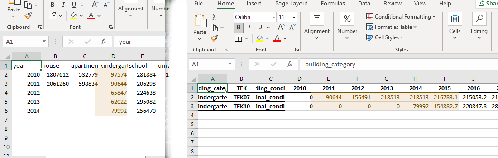

  
# Beregne fremskriving av areal  
  
Programmet calculate-area-forecast framskriver areal basert på samme metode som BEMA-modellen. Beregningen blir gjort basert på parametere som kan endres av brukeren.  
  
Dette dokumentet er laget for *calculate-area-forecast* versjon 0.8.3.  
  
  
## Hvordan få tilgang?  
  
Det er mulig å installere *calculate-area-forecast* på egen maskin. Det er enklere å kjøre programmet ferdiginnstallert på NVE-serveren e-srv12. Om du ikke allerede har brukt denne serveren, kan det være nødvendig å spørre brukerstøtte om tilgang. Tilgang til serveren krever at man er tilkoblet nettverket til NVE.  
  
  
## Koble til server  
  
  
  
For å koble til e-srv12 kan man bruke programmet *Tilkobling til eksternt skrivebord* (eng: *Remote Desktop Connection*)  
  
Start *Tilkobling til eksternt skrivebord*.  
  
I feltet for Datamaskin skal det stå `e-srv12`  
  
Klikk på koble til.  
  
  
  
  
  
## Powershell  
  
Programmet må kjøres via *Windows Powershell*.  
  
Klikk på start menyen på e-srv12 og skriv `powershell` velg *Windows Powershell* for å starte.  
  
  
  
For å gjøre det enklere å finne frem til filene du jobber med, er det en god idé å gå til `Documents` i Powershell. Man oppnår dette ved å skrive `cd documents` og deretter trykke på `enter`.  
  
## Kjøre calculate-area-forecast  
  
For å starte programmet skriver du *calculate-area-forecast* i *Windows Powershell* og trykker på `enter`. Første gang programmet kjøres vil du få en feilmelding. Oppsettet med parametere for beregningen mangler.  
  
  
  
For å lage nytt oppsett skriv `calculate-area-forecast --create-input` i Powershell og trykk på `enter`. Standard oppsett blir nå opprettet i underkatalogen `input`.  
  
  
  
  
For å se oppsettet kan man skrive `explorer input` i *Windows Powershell*. Filene i oppsettet kan redigeres med Excel.  
  
  
  
Når oppsettet er opprettet kan man kjøre modellen på nytt med *calculate-area-forecast* i *Windows Powershell* og trykke på `enter`. Resultatet av kjøringen blir liggende i underkatalogen `output` med filnavnet `ebm-area-forecast.xlxs`. Denne filen kan du åpne i *Excel*.  
  
  
  
Resultatet kan åpnes automatisk i Excel ved å skrive `calculate-area-forecast --open` i *Windows Powershell*.  
  
  
  
  
## Filtrere  
  
Det er mulig å filtrere datasettet før det skrives til regneark. Det er filter for byggningskategori, byggningstilstand og TEK. Man kan bruke filter ved å legge de til som argumenter til *calculate-area-forecast*.  
  
### Filtrere på kategori  
  
For å filtrere på kategori kan man bruke `--categories` og deretter liste opp ønskede kategorier adskilt med `mellomrom`.  
  
Liste over kategorier finner man i hjelpeteksten. `calculate-area-forecast --help`  
  
#### Eksempel  
`calculate-area-forecast --categories house apartment_block kindergarten`  
  
### Filtrere på tilstand  
  
For å filtrere på kategori kan man bruke `--conditions` og deretter liste opp ønskede kategorier adskilt med `mellomrom`.  
  
#### Eksempel  
`calculate-area-forecast --conditions original_condition small_measure`  
  
#### Alle tilstander  
`calculate-area-forecast --conditions original_condition small_measure renovation renovation_and_small_measure demolition`  
  
  
### Filtrere på TEK  
  
For å filtrere på kategori kan man bruke `--tek` og liste opp ønskede kategorier adskilt med `mellomrom`.  
  
Liste over TEK finner man i hjelpeteksten.  
#### Eksempel  
`calculate-area-forecast --tek TEK10 TEK17 TEK21`  
  
### Filtrere på flere  
  
Filter kan kombineres  
  
`calculate-area-forecast output/barnehage-riving-tek.xlsx --categories kindergarten --conditions demolition --tek TEK49_COM --open`  
  
  
## Endre input  
  
Framskriving utføres basert på filene i underkatalogen input. Beregningen kan påvirkes ved å gjøre endringer i input. I eksempelet under er årlig nybygget areal for barnehager (kindergarten) endret for årene 2010 til 2014. Endringen er utført i filen `area_new_residential_buildings.csv`.  
#### Før endring  
  
  
  
`input/area_new_residential_buildings.csv` til venstre  
`output/ebm_area_forecast.xlsx` til høyre  
  
#### Etter endring  
  
  
  
`input/area_new_residential_buildings.csv` til venstre  
`output/ebm_area_forecast.xlsx` til høyre  
  
Det er mulig å endre oppsett som  
- Nybygget areal per år `area_new_residential_buildings.csv`  
- befolkning og husholdningstørrelse (2010 - 2050), `new_buildings_population.csv`  
- andel hus og leilighet `new_buildings_house_share.csv`  
- periode og byggeår per tek `building_code.csv`  
- Hvilket år man starter riving for gitt byggkategori og TEK `s_curve.csv`  
  
Forbedret dokumentasjon for input og datamodellen vil komme senere.  
  
## Alternativ input  
  
Ved å bruke argumentet `--input` går det an å styre programmet til å lese input fra en alternativ katalog. Funksjonen gjør at man kan for eksempel kan håndtere flere scenarier. `--input` blir lest om man kjører beregning og om man lager ny input med `--create-input`  
  
### Lage nytt scenario  
  
`calculate-area-forecast --input=scenario1 --create-input`  
  
  
  
### Bruke nytt scenario  
  
Her blir scenario1 brukt for lage ny fremskriving for barnehager og skriver resultatet  
til `output\barnehage-scenario1.xlsx`.  
  
`calculate-area-forecast output\barnehage-scenario1.xlsx --categories kindergarten --input=scenario1`  
``  
  
Legg merke til at argumentet `--input=scenario1` må være med så lenge man ønsker å bruke scenario1.  
  
## Flere eksempler  
  
### Skrive til CSV (kommaseparert fil)  
  
`calculate-area-forecast barnehage.csv --categories kindergarten --delimiter=, `  
  
Bruk `--delimiter=";"` for semikolonseparert fil.  
### Skrive til og åpne eksisterende fil
  
`calculate-area-forecast output/hus_og_blokk.xlsx --categories house apartment_block --force --open`  
  
  
### År i kolonner fra venstre til høyre (D til AQ)  
  
`calculate-area-forecast --tek TEK10 --open --horizontal`  
  
  
## Mer informasjon  
  
Mer informasjon om programmet *calculate-area-forecast* kan man lese ved å skrive `calculate-area-forecast --help`