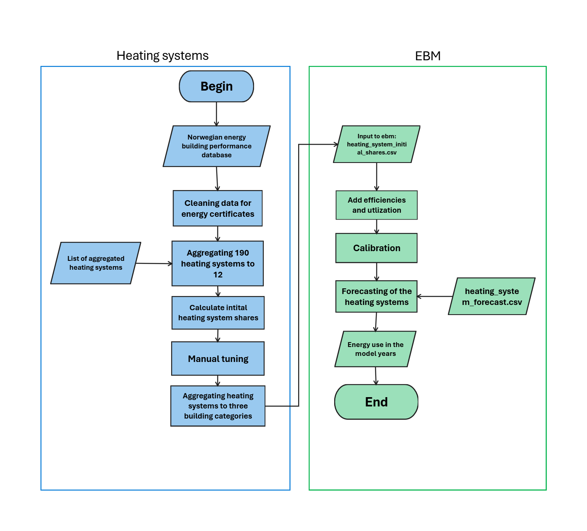

.. _heating_systems Heating systems:

Heating systems
#################

Heating systems is the link from the computed *energy need* to *energy use*. *Energy need* states what the building requires in 
terms of space heating, non-substitutable electrical use and hot tap water. Heating systems assigns specific heating technologies to meet the energy
demand of space heating and hot tap water. Various heating technologies have different efficiencies and energy carriers which then gives an *energy use*.
The energy useage per carrier and building category is compared with the national energy balance to fine tune the distribution of the various 
heating technologies. 

The current implementation of forecasting for energy
systems is simplified, meaning it is not based on an economic optimization model such as `TIMES <https://iea-etsap.org/index.php/etsap-tools/model-generators/times>`_.

.. toctree::
   :caption: Content
   :maxdepth: 1

   methods
   assumptions

 

Heating systems glossary
------------------------
.. csv-table:: Glossary of terms used in heating systems
  :file: ..\tables\heating_systems_glossary_csv.csv
  :header-rows: 1
  :widths: 10 10 30 30
  :delim: ;

Tables
------
The tables below show the various combinations of heating systems and heating technologies.

.. csv-table:: Heating systems efficiency
  :file: ..\tables\heating_systems_efficiencies.csv
  :widths: 15 15 15 15 5 5 5
  :header-rows: 1
  :delim: ;

.. csv-table:: Heating systems coverage
  :file: ..\tables\heating_systems_coverage.csv
  :widths: 15 15 15 15 5 5 5
  :header-rows: 1
  :delim: ;

.. csv-table:: Heating systems hot tap water
  :file: ..\tables\heating_systems_dhw.csv
  :widths: 15 15 15
  :header-rows: 1
  :delim: ;

.. |br| raw:: html

       

.. |date| date::

Last Updated on |date|.

Version: |version|.
